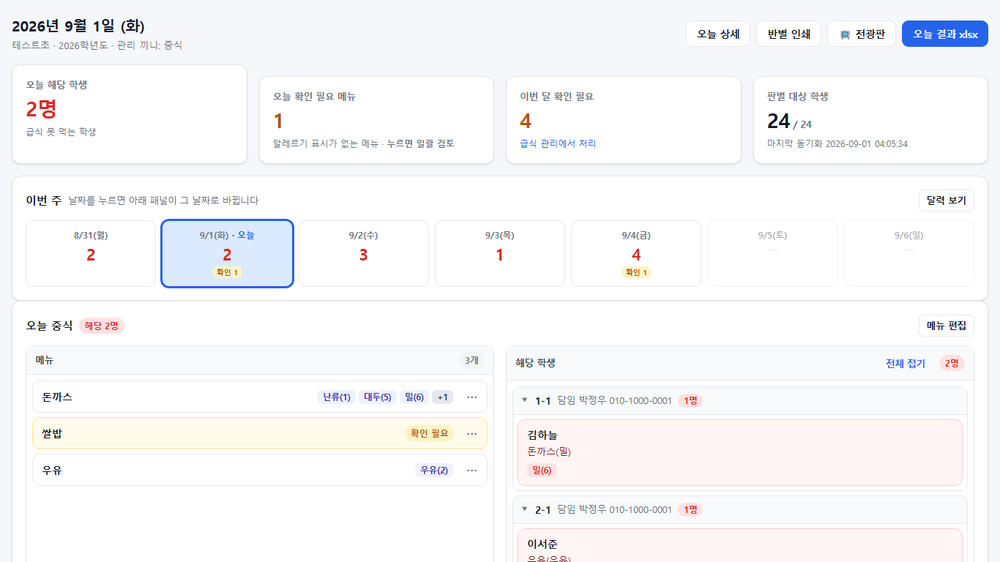
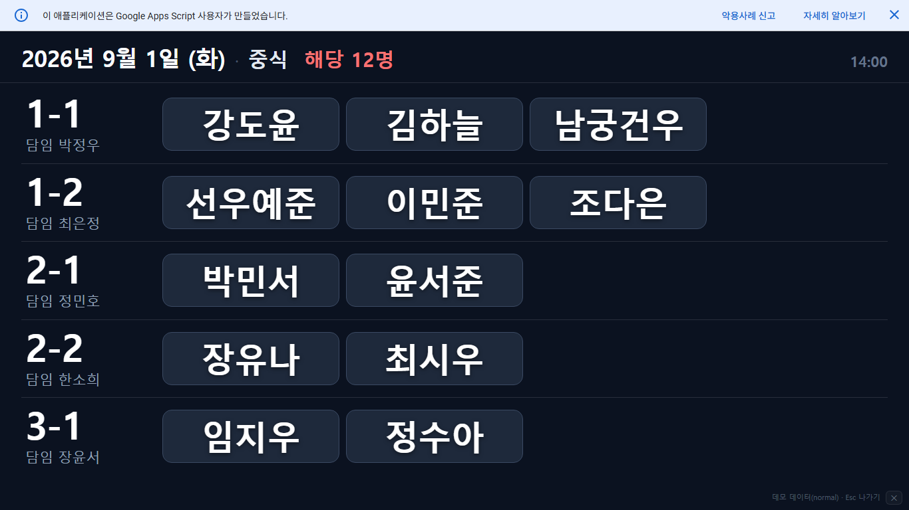
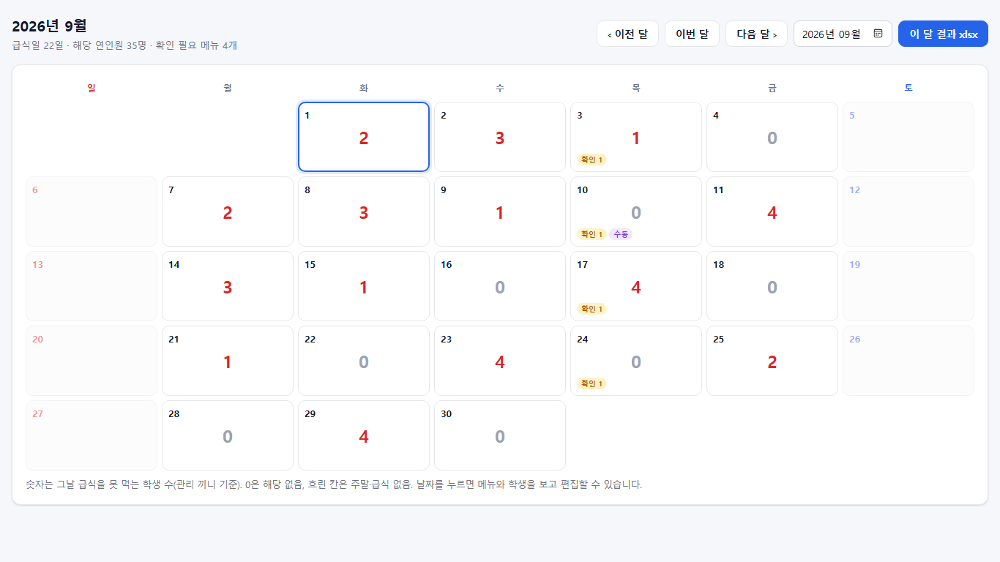
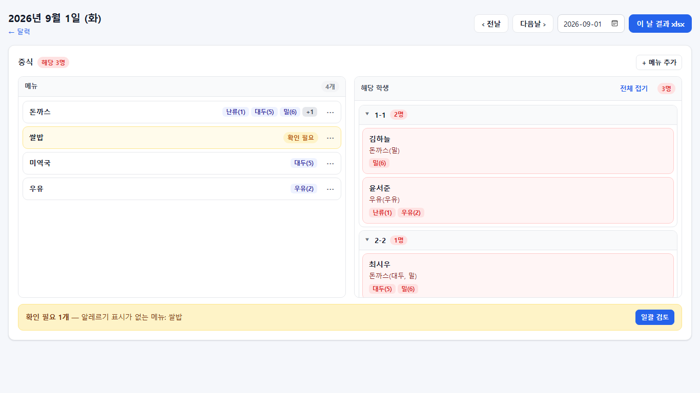
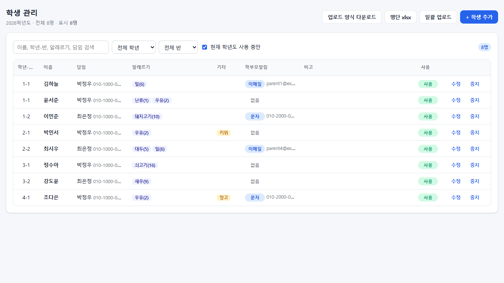
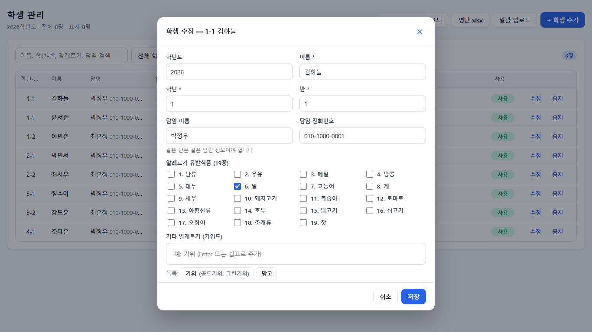
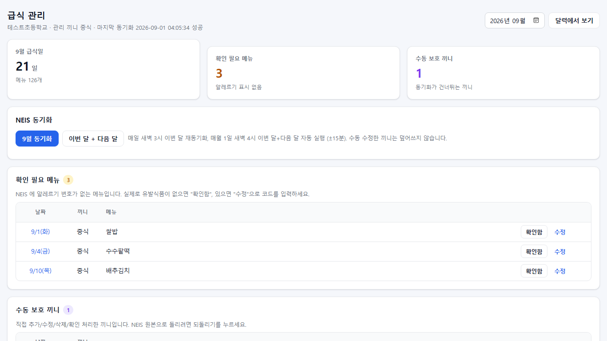
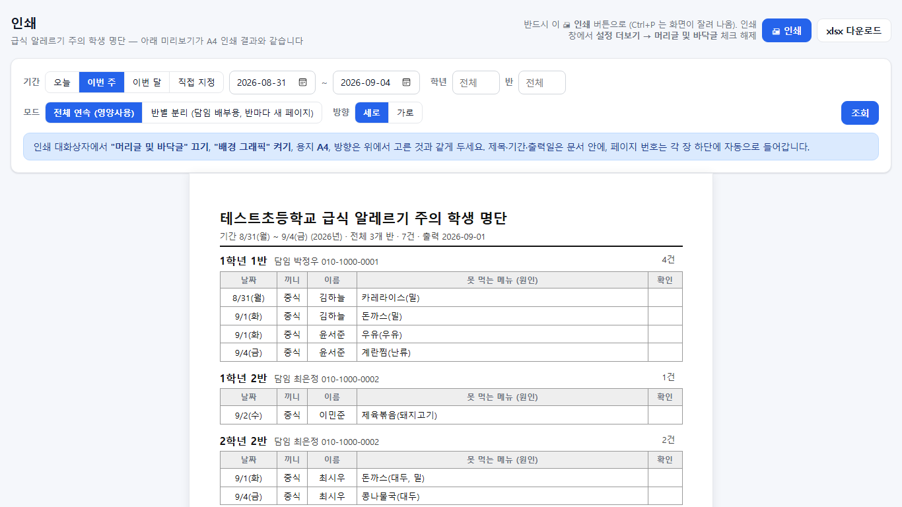
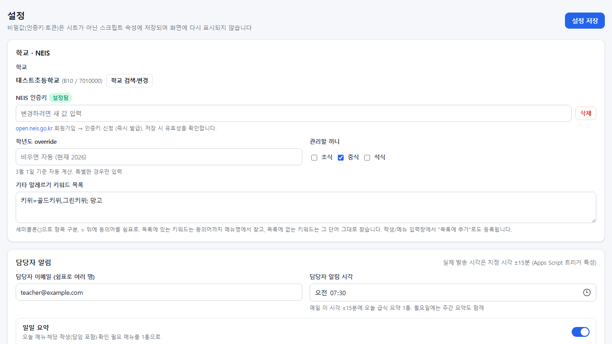
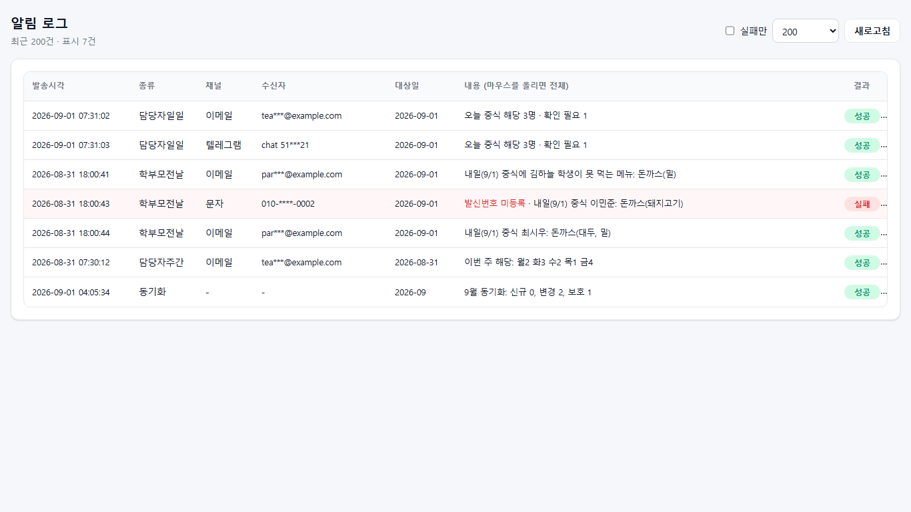

# 🍽️ 급식 알레르기 판별 시스템


학생의 알레르기 정보와 NEIS 급식 식단을 **매일 자동으로 대조**해서 "오늘/이번 주/이번 달 급식을 못 먹는 학생"을 바로 보여주고, 담당자·학부모에게 알림까지 보내는 시스템입니다.

- **비용 0원** — Google 스프레드시트 + Apps Script 만 사용 (문자 알림만 선택적 유료)
- **서버 없음, 설치 없음** — 학교 담당자는 웹앱 링크 하나만 열면 됩니다
- **데이터는 내 구글 계정 안에** — 학생 정보가 외부 서버로 나가지 않습니다

## 스크린샷

> 아래 그림은 모두 **가상 데이터**입니다 (실제 학생 정보 없음).

| | |
|---|---|
| **대시보드** — 오늘 해당 학생·확인 필요·주간 요약  | **전광판** — 급식실 모니터용, 반별 큰 글씨·자동 페이지  |
| **달력** — 날짜별 해당 인원 한눈에  | **날짜 상세** — 메뉴 편집 시 해당 학생 즉시 재계산  |
| **학생 관리** — 검색·정렬·엑셀 일괄 업로드  | **학생 수정** — 19종 체크 + 기타 키워드(동의어 매칭)  |
| **급식 관리** — NEIS 동기화·확인 필요·수동 보호  | **인쇄** — A4 미리보기 = 인쇄 결과, 반별 분리 모드  |
| **설정** — 알림 시각·채널 테스트·발송 미리보기  | **알림 로그** — 발송 이력, 수신자는 가려서 기록  |

## 화면 구성

| 화면 | 내용 |
|---|---|
| 대시보드 | 오늘 해당 학생, 이번 주 요약, 확인 필요 메뉴, 최근 알림 실패("확인함 · 숨기기"로 치울 수 있음) |
| 전광판 | 대시보드의 **📺 전광판** 버튼(또는 주소 뒤에 `#/board`). 급식실 모니터용 — 오늘 해당 학생만 반별로 큰 글씨, 자동 페이지 넘김(8초)·자동 새로고침(5분). F11 로 전체화면, Esc 로 나가기 |
| 달력 | 날짜별 해당 인원, 클릭하면 메뉴·학생 상세와 편집 |
| 학생 관리 | 검색/추가/수정, 엑셀(xlsx·붙여넣기) 일괄 업로드, 양식·명단 다운로드. 상단 **알레르기별 인원 칩**(클릭하면 그 알레르기 학생만), 이름 클릭 → **학생별 월간 현황**(그 학생이 못 먹는 날·메뉴만 달력으로) |
| 급식 관리 | NEIS 동기화, 확인 필요 메뉴 처리, 수동 보호, 월 xlsx 내보내기/가져오기 |
| 설정 | 학교·NEIS 키, 알림 시각, 채널(이메일/텔레그램/문자), 학부모 알림, 비밀번호 |
| 알림 로그 / 인쇄 | 발송 이력 · 인쇄용 명단(기간: 오늘/이번 주/이번 달/직접, 모드: 전체 연속(영양사용) 또는 반별 분리(담임 배부용), 세로/가로, A4 미리보기 = 인쇄 결과) |

---

## 목차

1. [준비물](#1-준비물)
2. [설치 (처음 한 번, 약 20분)](#2-설치-처음-한-번-약-20분)
3. [초기 설정](#3-초기-설정)
4. [웹앱 배포와 링크 공유](#4-웹앱-배포와-링크-공유)
5. [학생 등록](#5-학생-등록)
6. [알림 설정](#6-알림-설정)
7. [접속 비밀번호(잠금) 모드](#7-접속-비밀번호잠금-모드)
8. [매일 운영 방법](#8-매일-운영-방법)
9. [코드 업데이트](#9-코드-업데이트)
10. [다른 구글 계정으로 이관하기 (15분)](#10-다른-구글-계정으로-이관하기-15분)
11. [문제 해결](#11-문제-해결)
12. [개발자 정보](#12-개발자-정보)

---

## 1. 준비물

| 항목 | 설명 |
|---|---|
| **전용 구글 계정** | 시트·스크립트·웹앱을 이 계정 하나로 운영합니다. 개인 계정보다 학교용 계정을 새로 만드는 것을 권장합니다 (예: `school-allergy@gmail.com`). 알림 메일도 이 계정 이름으로 발송됩니다. |
| **NEIS 개방포털 인증키** | https://open.neis.go.kr 회원가입 → 로그인 → 상단 "인증키 신청" → 즉시 발급 (무료). |
| **컴퓨터 1대 (설치 때만)** | Windows/Mac. Node.js 를 설치해 명령어 몇 줄을 실행합니다. 설치가 끝나면 이 컴퓨터는 더 이상 필요 없습니다. |
| (선택) 텔레그램 봇 토큰 | 담당자 알림을 텔레그램으로도 받고 싶을 때. 무료. |
| (선택) 알리고 문자 계정 | 학부모 문자 알림용. 유료 (건당 약 10원대). |

> **주의**: 학생 알레르기 정보는 개인정보입니다. 전용 계정의 비밀번호와 2단계 인증을 반드시 설정하고, 웹앱 링크는 담당자에게만 공유하세요. 7절의 잠금 모드를 켜는 것을 권장합니다.

---

## 2. 설치 (처음 한 번, 약 20분)

### 2-1. Node.js 설치
1. https://nodejs.org 에서 **LTS** 버전을 내려받아 설치합니다 (기본값으로 다음 → 다음).
2. 설치 확인: Windows 는 **PowerShell**, Mac 은 **터미널**을 열고 아래를 입력합니다.
   ```
   node --version
   ```
   `v20.x.x` 처럼 버전이 나오면 성공입니다.

### 2-2. 이 프로젝트 내려받기
GitHub 에서 **Code → Download ZIP** 으로 받아 압축을 풀거나, git 을 쓸 줄 알면 clone 합니다.
압축을 푼 폴더(예: `C:\dev\meal-allergen-checker`)를 터미널에서 엽니다.
```
cd C:\dev\meal-allergen-checker
```

### 2-3. clasp 설치와 로그인
clasp 는 이 폴더의 코드를 구글 Apps Script 로 올려 주는 구글 공식 도구입니다.
```
npm install -g @google/clasp
clasp login
```
브라우저가 열리면 **전용 구글 계정**으로 로그인하고 권한을 허용합니다.

### 2-4. Apps Script API 켜기
브라우저에서 https://script.google.com/home/usersettings 를 열고(전용 계정으로) **Google Apps Script API** 를 **사용**으로 바꿉니다. 이걸 안 켜면 다음 단계가 실패합니다.

### 2-5. 스프레드시트 + 스크립트 만들기
```
clasp create --type sheets --title "급식 알레르기 판별" --rootDir src
```
전용 계정의 내 드라이브에 스프레드시트와 연결된 스크립트가 만들어지고, 폴더에 `.clasp.json` 이 생깁니다.

> ⚠ `clasp create` 는 `src/appsscript.json` 을 기본값으로 **덮어씁니다**. 반드시 git 에서 원본을 되돌리세요:
> ```
> git checkout -- src/appsscript.json
> ```
> (ZIP 으로 받은 경우 ZIP 안의 `src/appsscript.json` 을 다시 복사해 넣습니다.) 시간대 `Asia/Seoul` 과 권한 목록이 들어 있어야 합니다.

### 2-6. 코드 올리기
```
npm test
npm run push
```
`Pushed NN files` 가 나오면 완료입니다.

---

## 3. 초기 설정

### 3-1. 시트에서 "초기 설정" 실행
1. `clasp create` 가 출력한 스프레드시트 링크를 열거나, 전용 계정 드라이브에서 **급식 알레르기 판별** 시트를 엽니다.
2. 몇 초 뒤 상단 메뉴에 **[급식 알레르기]** 가 나타납니다. **[급식 알레르기] → 초기 설정** 을 누릅니다.
3. **권한 승인 창**이 뜹니다: 계속 → 전용 계정 선택 → "Google 에서 확인하지 않은 앱" 경고에서 **고급 → (프로젝트 이름)(으)로 이동** → **허용**.
   (직접 만든 스크립트라서 뜨는 정상 경고입니다.)
4. 승인 후 메뉴가 그냥 닫히면 **초기 설정을 한 번 더** 누릅니다.
5. 완료 알림창에 **웹앱 접속 비밀번호**가 1회 표시됩니다. 지금 기록하세요. (잊으면 메뉴 → 접속 비밀번호 → 비밀번호 재설정)

초기 설정이 하는 일: 시트 5개 생성(학생·급식·설정·알림로그·학생_업로드템플릿), 드롭다운/체크박스/서식 적용, 자동 실행 트리거 5개 등록. **여러 번 실행해도 안전**하며, 코드 업데이트 후 열 구조가 바뀌면 자동으로 맞춰 줍니다.

### 3-2. NEIS 인증키와 학교 등록
시트 메뉴에서 바로 할 수 있습니다 (웹앱 설정 화면에서도 가능).
1. **[급식 알레르기] → NEIS 인증키 입력/변경** → 발급받은 키 붙여넣기. 유효한 키만 저장됩니다.
2. **[급식 알레르기] → 학교 검색·선택** → 학교명 입력 → 번호 선택.
3. **[급식 알레르기] → 지금 급식 동기화** → 이번 달·다음 달 식단이 `급식` 시트에 들어옵니다.

> 인증키는 시트가 아니라 스크립트 속성(비공개 저장소)에 저장되며 화면 어디에도 다시 표시되지 않습니다.

### 3-3. 설정 시트 값 (필요 시)
`설정` 시트에서 직접 고치거나 웹앱 설정 화면에서 바꿉니다.

| 키 | 기본값 | 설명 |
|---|---|---|
| 관리할끼니 | 중식 | `조식,중식` 처럼 쉼표로 여러 개 |
| 담당자알림시간 | 07:30 | 매일 담당자 요약 발송 시각 (**±15분 오차**) |
| 학부모알림시간 | 18:00 | 전날 학부모 발송 시각 (**±15분 오차**) |
| 담당자이메일 | | 쉼표로 여러 명 |
| 학부모알림사용 | FALSE | 켜야 학부모에게 발송 |
| 주말공휴일알림 | FALSE | 급식 없는 날에도 담당자 메일을 보낼지 |
| 기타알레르기목록 | | `키위=골드키위,그린키위; 망고` 형식의 키워드·동의어 목록 |

---

## 4. 웹앱 배포와 링크 공유

### 4-1. 배포 (처음 한 번)
터미널(프로젝트 폴더)에서:
```
npm run deploy -- "첫 배포"
```
테스트 → 코드 올리기 → 배포까지 자동으로 진행되고 마지막에 **웹앱 URL** 이 출력됩니다.
```
https://script.google.com/macros/s/AKfycb.../exec
```
배포 ID 는 `.deployment-id` 파일에 저장됩니다. **이 파일을 지우지 마세요.** 이후 `npm run deploy` 는 항상 같은 배포를 갱신하므로 **URL 이 바뀌지 않습니다**. (새 배포를 만들면 URL 이 바뀌어 담당자에게 다시 알려야 합니다.)

> **주소 형태 주의 (Google Workspace 계정)**: Apps Script 편집기의 배포 관리 화면이나 브라우저 주소창에는
> `https://script.google.com/a/macros/학교도메인/s/AKfycb.../exec` 처럼 **`/a/macros/도메인/`** 이 끼어 있는
> **조직 전용 주소**가 보일 수 있습니다. 이 주소는 그 조직 계정으로 로그인한 사람만 열 수 있어 외부 공유에 쓸 수 없습니다.
> 담당자·학부모에게는 항상 **`https://script.google.com/macros/s/배포ID/exec`** 형태(위 출력값, 또는 시트 메뉴 **웹앱 열기**)를 알려주세요.
> 시스템은 저장·표시·알림 메일 링크에서 조직 주소를 자동으로 표준 주소로 바꿉니다.

### 4-2. 첫 접속과 권한
1. **전용 계정으로 로그인된 브라우저**에서 URL 을 한 번 엽니다. 권한 승인 창이 뜨면 3-1 과 같이 허용합니다.
2. 이후에는 로그인하지 않은 브라우저(시크릿 창)에서도 열리는지 확인합니다. 학교 담당자는 이 조건으로 접속합니다.
3. 시트 메뉴 **[급식 알레르기] → 웹앱 열기** 에서도 링크를 볼 수 있습니다 (항상 `/macros/s/…/exec` 표준 주소로 표시).

### 4-3. 담당자에게 공유
URL 과(잠금 모드를 켠 경우) 비밀번호를 담당자에게 전달합니다. 스마트폰 브라우저에서도 동작합니다.

---

## 5. 학생 등록

### 5-1. 열 구조 (학생 시트 / 업로드 양식 동일)
| 학년도 | 학년 | 반 | 이름 | 담임이름 | 담임전화번호 | 알레르기코드 | 기타알레르기 | 비고 | 학부모이메일 | 학부모연락처 | 학부모알림 | 사용여부 |
|---|---|---|---|---|---|---|---|---|---|---|---|---|

- **필수**: 학년, 반, 이름. 학년도를 비우면 현재 학년도(3월 1일 기준)로 채워집니다.
- **학생 식별키 = 학년 + 반 + 이름.** 같은 반 동명이인은 허용되지만 업로드 미리보기에 경고가 뜨니 비고로 구분하세요.
- **알레르기코드**: 학교급식 표준 19종 번호를 쉼표로 (예 `1,2,6`).

  | 1 난류 | 2 우유 | 3 메밀 | 4 땅콩 | 5 대두 | 6 밀 | 7 고등어 | 8 게 | 9 새우 | 10 돼지고기 |
  |---|---|---|---|---|---|---|---|---|---|
  | 11 복숭아 | 12 토마토 | 13 아황산류 | 14 호두 | 15 닭고기 | 16 쇠고기 | 17 오징어 | 18 조개류 | 19 잣 | |
- **기타알레르기**: 19종 외 키워드를 쉼표로 (예 `키위,망고`). 메뉴명에 키워드가 포함되면 해당으로 판별합니다. 설정의 "기타알레르기목록"에 등록된 키워드는 동의어(예: 키위 = 골드키위)까지 찾습니다.
- **담임이름·담임전화번호**: 같은 반은 같은 값이어야 합니다. 다르면 경고가 뜹니다. 해당 학생 표시·인쇄·메일에 `담임 OOO 010-…` 로 붙습니다.
- **학부모알림**: `없음` / `이메일` / `문자`. 이메일이면 학부모이메일, 문자면 학부모연락처가 필요합니다.
- **사용여부**: 체크 해제하면 판별·알림에서 제외됩니다 (전학 등). 삭제 대신 이걸 쓰세요.

### 5-2. 등록 방법 세 가지
1. **웹앱 → 학생 관리 → 업로드 양식 다운로드** → 엑셀에서 채우기 → **일괄 업로드**(xlsx 파일 또는 복사-붙여넣기) → 미리보기에서 추가/수정/오류/경고 확인 → 반영.
   - 기존 학생과 학년·반·이름이 같으면 **수정**, 아니면 **추가**. 삭제는 하지 않습니다.
   - 오류 행이 하나라도 있으면 전체가 반려됩니다. 경고(동명이인·담임 불일치)는 반영을 막지 않습니다.
2. **웹앱 → 학생 관리 → + 학생 추가** (한 명씩).
3. **시트의 `학생_업로드템플릿`** 에 붙여넣고 메뉴 **[급식 알레르기] → 템플릿 → 학생 반영**.

---

## 6. 알림 설정

웹앱 **설정** 탭에서 합니다.

### 담당자 알림 (기본 켜짐)
- **일일 요약**: 매일 지정 시각(±15분)에 담당자 이메일로 1통 — 오늘 메뉴와 알레르기 번호, 해당 학생(담임 포함), 알레르기 표시 없는 메뉴.
- **주간 요약**: 매주 월요일 같은 시각.
- **동기화 결과**: 매월 1일 자동 동기화 후, 실패 시 즉시.
- 텔레그램을 켜면 같은 내용이 텔레그램으로도 갑니다. (봇 토큰 저장 → 봇에게 아무 메시지나 보낸 뒤 "chat id 찾기")

### 학부모 알림 (기본 꺼짐)
- 설정에서 **학부모 알림 사용**을 켜면, 학부모알림이 `없음`이 아닌 학생에게만 **전날 저녁** 개별 발송합니다. 금요일에는 다음 급식일(월요일) 기준.
- 문구 예: `[OO초] 내일(9/1) 중식에 홍길동 학생이 못 먹는 메뉴가 있습니다: 돈까스(밀, 돼지고기)`
- 문자 채널이 꺼져 있으면 문자 대상 학생은 이메일로 대체 발송하고 로그에 남깁니다.
- **미리보기** 버튼으로 실제 발송 없이 누구에게 무엇이 갈지 확인할 수 있습니다.

### 채널
| 채널 | 비용 | 준비 |
|---|---|---|
| 이메일 | 무료 | 없음. Gmail 무료 계정은 하루 약 100통 한도 — 담당자 알림은 1통으로 묶여 있습니다. 학부모가 많으면 한도를 확인하세요 (설정 화면에 남은 한도 표시). |
| 텔레그램 | 무료 | @BotFather 에서 봇 생성 → 토큰 입력 |
| 문자(알리고) | 유료 | smartsms.aligo.in 가입 → API 키·사용자 ID 입력, 발신번호 사전 등록 |

### 자동 실행 시각
Apps Script 의 시간 트리거는 지정 시각 **±15분** 안에서 실행됩니다. 정확한 분 단위 발송은 불가능합니다.
- 매일 03:00 이번 달 재동기화 / 매월 1일 04:00 이번 달+다음 달 동기화 / 담당자·학부모 알림은 설정 시각.
- 알림 시각을 바꾸면 트리거가 자동으로 다시 등록됩니다. 설정 화면 하단에서 등록 상태를 볼 수 있습니다.

---

## 7. 접속 비밀번호(잠금) 모드

시트 메뉴 **[급식 알레르기] → 접속 비밀번호** 에서만 바꿀 수 있습니다 (웹앱에는 없음). 바꾸면 재배포 없이 바로 적용됩니다.

| 모드 | 동작 |
|---|---|
| **사용 안 함** (기본) | 링크만 있으면 누구나 모든 화면. 링크 공유에 주의 |
| **설정 탭만 잠금** | 대시보드·달력·학생·급식·인쇄·로그는 자유, **설정 탭만** 비밀번호. 담당 교사 여러 명이 쓸 때 권장 |
| **전체 잠금** | 모든 화면에 로그인 필요 |

비밀번호는 같은 메뉴의 **비밀번호 재설정**으로 새로 만들 수 있고, 웹앱 설정 탭에서 원하는 값으로 바꿀 수 있습니다. 재설정하면 다른 기기의 로그인은 모두 풀립니다.

---

## 8. 매일 운영 방법

평소에는 할 일이 없습니다. 급식은 새벽에 자동으로 갱신되고, 아침에 담당자 메일이 옵니다.

- **확인 필요 메뉴**: NEIS 에 알레르기 번호가 없는 메뉴(김치·과일 등)는 "확인 필요"로 표시됩니다. 실제로 유발식품이 없으면 **확인함**, 있으면 **수정**으로 코드를 입력하세요. 급식 관리 탭에서 한 달치를 한 번에 처리할 수 있습니다.
- **식단이 갑자기 바뀐 날**: 날짜 상세에서 메뉴를 수정/추가/삭제하면 그 끼니는 **수동 보호**되어 자동 동기화가 덮어쓰지 않습니다. NEIS 원본으로 되돌리려면 "NEIS 데이터로 되돌리기".
- **담임에게 나눠주기**: 인쇄 탭에서 기간·반을 고르고 인쇄(반마다 한 페이지) 또는 xlsx 다운로드.
- **학년 초**: 새 학년도 명단을 일괄 업로드하면 됩니다. 지난 학년도 학생은 학년도가 달라 판별에서 자동 제외됩니다.
- **↻ 새로고침**: 시트를 직접 고친 뒤 웹앱에 바로 반영되지 않으면 상단의 새로고침 버튼을 누르세요 (캐시는 최대 10분).

---

## 9. 코드 업데이트

새 버전을 받은 뒤 프로젝트 폴더에서:
```
npm run deploy -- "업데이트 내용"
```
URL 은 그대로 유지됩니다. 열 구조가 바뀐 업데이트라면 시트에서 **초기 설정**을 한 번 더 실행하세요.

---

## 10. 다른 구글 계정으로 이관하기 (15분)

담당자가 바뀌어 다른 계정으로 옮길 때. 시트 **사본 만들기**는 코드까지 복사하지만 **비밀값(인증키 등), 자동 실행 트리거, 웹앱 배포는 복사되지 않으므로** 아래 순서로 다시 만듭니다.

| 순서 | 어디서 | 할 일 |
|---|---|---|
| 1 | 구 계정 시트 | **[급식 알레르기] → 이관용 설정 내보내기** → 나온 JSON 을 복사해 메모장에 저장 (비밀값은 포함되지 않고, 어떤 항목을 다시 입력해야 하는지 목록만 들어 있음) |
| 2 | 구 계정 시트 | 공유 → 새 계정을 **편집자**로 추가 |
| 3 | 새 계정 | 공유받은 시트 열기 → 파일 → **사본 만들기** (내 드라이브) → 사본 열기 |
| 4 | 새 계정 사본 | **[급식 알레르기] → 초기 설정** → 권한 승인 (트리거가 새 계정 소유로 등록, 새 비밀번호 표시) |
| 5 | 새 계정 사본 | **[급식 알레르기] → 이관용 설정 가져오기** → 1번 JSON 붙여넣기 → 가져오기 (설정 확인 + 비밀값 재입력 체크리스트) |
| 6 | 새 계정 사본 | **NEIS 인증키 입력/변경** 으로 키 재입력. 텔레그램·문자 키도 웹앱 설정에서 재입력 |
| 7 | 새 계정 | 확장 프로그램 → Apps Script → **배포 → 새 배포 → 유형: 웹 앱** → 실행 사용자 "나", 액세스 "모든 사용자" → 배포 → **새 URL** 확보 (편집기가 `/a/macros/도메인/` 주소를 보여주면 그 부분을 뺀 `/macros/s/…/exec` 형태를 공유. 시트 메뉴 **웹앱 열기**가 변환해 줌). (로컬 clasp 를 계속 쓰려면 새 계정으로 `clasp login` 후 `clasp clone-script <새 scriptId> --rootDir src`, `.deployment-id` 삭제 후 `npm run deploy`) |
| 8 | 구 계정 시트 | **[급식 알레르기] → 이 계정의 트리거 모두 해제** (중복 알림 방지). Apps Script 배포 관리에서 기존 웹앱 배포 보관 처리 |
| 9 | | 담당자에게 **새 URL** 과 비밀번호 공지. 스크립트가 달라지므로 URL 은 반드시 바뀝니다 |

---

## 11. 문제 해결

실제로 겪었던 오류의 원인·해결 과정은 별도 문서 `문제해결사례.docx` 에 정리돼 있습니다 (저장소 미포함 — 담당자에게 요청).

| 증상 | 확인할 것 |
|---|---|
| 시트에 [급식 알레르기] 메뉴가 없음 | 새로고침(F5). 그래도 없으면 `npm run push` 가 성공했는지, `.clasp.json` 의 scriptId 가 이 시트의 스크립트인지 확인 |
| 초기 설정 시 "승인 필요"만 뜨고 끝남 | 정상. 승인 후 초기 설정을 한 번 더 실행 |
| 웹앱에 "이 앱을 실행하려면 승인이 필요합니다" | 전용 계정으로 로그인된 창에서 URL 을 한 번 열어 승인. 또는 시트에서 초기 설정 재실행 |
| 웹앱을 열면 **빈 화면**(흰 화면·로딩만 계속) | 웹앱은 구글 iframe 안에서 돌아가므로 **서드파티 쿠키가 차단되면 빈 화면**이 됩니다. ① 브라우저 설정에서 서드파티(타사) 쿠키 허용 — Chrome: 설정 → 개인 정보 보호 및 보안 → 서드파티 쿠키 → "서드파티 쿠키 허용" 또는 `[*.]google.com` 을 허용 사이트에 추가 / Edge: 설정 → 쿠키 및 사이트 권한 → 타사 쿠키 차단 해제 / Safari: 설정 → 개인 정보 보호 → "크로스 사이트 추적 방지" 해제. ② 시크릿(InPrivate) 창은 기본으로 차단이니 일반 창에서 시도. ③ 그래도 안 되면 **다른 브라우저**(Chrome ↔ Edge)나 다른 구글 계정으로 로그인한 프로필에서 시도. ④ 광고 차단 확장 프로그램을 잠시 끄기 |
| 웹앱 탭을 누르면 빈 화면 / 주소가 `userCodeAppPanel` 로 바뀜 | 구버전 증상. `npm run deploy` 로 최신 코드 재배포 |
| 상단 메뉴바만 보이고 **본문이 비어 있음** (콘솔 오류 없음, 만든 사람 브라우저에서만 정상) | 배포 @11 이하 구버전 버그 — 잠금 해제 모드에서 로그인 토큰이 없는 브라우저는 본문을 그리지 않았음. `npm run deploy` 로 최신 코드 재배포 (@12 이상) |
| `clasp` 명령이 `invalid_grant` / `invalid_rapt` 오류 | 로그인 토큰 만료. `clasp login` 을 다시 실행해 전용 계정으로 재로그인 후 명령 재시도 |
| 동기화 "NEIS 인증키가 설정되지 않았습니다" | 시트 메뉴 → NEIS 인증키 입력/변경 |
| 동기화 "INFO-200 해당하는 데이터가 없습니다" | 그 달 식단이 아직 NEIS 에 올라오지 않음(방학·월초). 며칠 뒤 자동 재시도됨 |
| 동기화 "ERROR-290/INFO-100 인증키" | 키 오타 또는 발급 직후(몇 분 대기). 개방포털에서 키 상태 확인 |
| 담당자 메일이 안 옴 | 설정 → 담당자 이메일 입력·저장 → "이메일 테스트". 알림 로그 탭에서 실패 사유 확인. 트리거 등록 여부는 설정 하단 |
| 알림 시각이 5~15분 어긋남 | Apps Script 트리거 특성(±15분). 정상 |
| xlsx 다운로드/업로드 실패 (권한) | 권한 승인 때 Drive 권한을 거부한 경우. 시트에서 초기 설정 재실행 → 승인 창에서 모두 허용 |
| 시트를 직접 고쳤는데 웹앱에 안 보임 | 웹앱 상단 ↻ 새로고침 (캐시 최대 10분) |
| 담임이 "미등록"으로 나옴 | 그 반 학생 행의 담임이름이 모두 비어 있음. 한 명만 채워도 반 전체에 적용 |
| 표에 "불일치" 배지 | 같은 반 학생들의 담임이름/전화번호가 서로 다름. 학생 관리 상단 경고에서 어떤 값들인지 확인 후 통일 |
| Gmail 발송 한도 초과 | 무료 계정 하루 약 100통. 학부모 이메일 대상이 많으면 Google Workspace 계정(1,500통) 사용 고려 |

로그 보기: 웹앱 **알림 로그** 탭, 또는 Apps Script 편집기 → 실행(왼쪽 시계 아이콘).

---

## 12. 개발자 정보

### 구조
```
src/                 clasp 가 올리는 루트
  appsscript.json    시간대 Asia/Seoul, V8, Drive 고급 서비스, OAuth 스코프, 웹앱 설정
  core/              순수 로직 (Apps Script 의존 없음, Node 테스트 대상)
    constants.js     시트 이름·헤더·설정 키·알레르기 19종 (단일 출처)
    neisParser.js    NEIS 응답·DDISH_NM 파싱
    allergyCheck.js  코드/키워드(동의어) 판별, 학생·메뉴 정규화
    studentValidator.js  업로드 검증·병합 계획(동명이인·담임 경고)
    teachers.js      학생 행에서 반별 담임 유추
    syncDiff.js      재동기화/되돌리기/가져오기 계획 (수동 보호)
    messages.js      담당자·학부모·동기화 알림 문구, 중복키
    dateUtil.js, tableUtil.js
  gas/               Apps Script 의존 코드
    Setup.js         커스텀 메뉴, setup(), 열 마이그레이션, 트리거, 인증 모드 메뉴
    Format.js        시트 서식 · Sheets.js 리포지토리 · Props.js 설정/비밀값 · Cache.js 캐시
    Auth.js          비밀번호 해시, 세션, 인증 모드 · Neis.js · Sync.js · Notify.js · channels/
    WebApp.js, ApiStudents.js, ApiMeals.js, ApiSettings.js, Xlsx.js  웹앱 API
    Migration.js     이관 내보내기/가져오기 · Triggers.js
  ui/                HtmlService SPA (index.html, styles.css.html, app.js.html, views/*.js.html)
test/                node:test (핵심 로직 68건) — `npm test` 는 .html 안 스크립트 문법 검사도 포함
scripts/deploy.js    같은 배포 ID 로 재배포 (URL 고정)
SPEC.md              요구사항의 단일 출처 · CLAUDE.md 프로젝트 규칙
```

### 명령
| 명령 | 설명 |
|---|---|
| `npm test` | 문법 검사 + 핵심 로직 테스트 |
| `npm run push` | 테스트 후 Apps Script 로 코드 업로드 (배포는 안 함) |
| `npm run deploy -- "설명"` | 테스트 → push → 같은 배포 ID 로 재배포 (최초 실행 시 배포 생성 후 `.deployment-id` 저장) |
| `npm run open` | Apps Script 편집기 열기 · `npm run logs` 로그 |

### 설계 메모
- 모든 `api*` 함수는 첫 인자로 세션 토큰을 받고 `requireSession(token[, 'admin'])` 로 시작. 설정 계열은 `admin`.
- 학생/급식/설정 읽기는 CacheService 10분 캐시. 시트 쓰기와 직접 편집(`onEdit`)에서 데이터 버전을 올려 즉시 무효화.
- 비밀값은 Script Properties 에만. 로그·이관 JSON 에는 "설정됨" 여부만.
- 웹앱은 iframe 안에서 실행되므로 내부 링크는 `location.hash` 만 바꿉니다. 화면 이벤트는 `App.on()` 교체 방식으로만 바인딩(누적 방지).
- 자세한 요구사항과 결정 사항은 `SPEC.md` 를 보세요.
